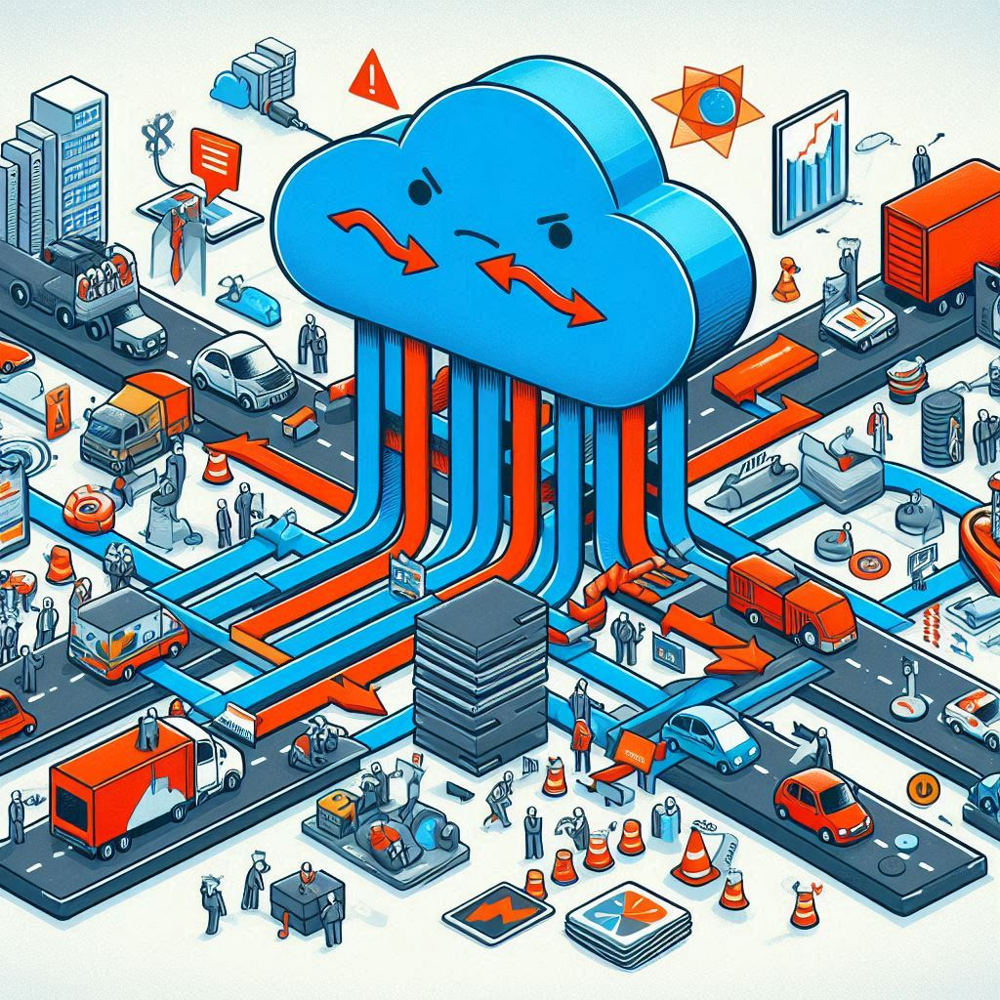

# Postmortem: Load Balancer Outage

## Issue Summary

On July 8, 2024, the load balancer (`lb-01`) was down from 3 PM UTC+1 to 6 PM UTC+1. During this outage, both web servers (`web-01` and `web-02`) were unable to handle traffic correctly. This led to a complete service outage for around 70% of our users, who experienced errors or were unable to access the site.

The root cause of the outage was a misconfiguration in the load balancer’s routing rules, which disrupted the distribution of traffic between the servers.

## Timeline

- **3:00 PM UTC+1**: Monitoring alert triggered, indicating an issue with traffic distribution from `lb-01`.
- **3:05 PM UTC+1**: Issue detected by the operations team, who observed a spike in failed health checks and slower response times.
- **3:10 PM UTC+1**: Initial investigation began. Suspected a configuration error or potential network issue.
- **3:30 PM UTC+1**: Examined load balancer logs and identified inconsistent routing rules. Initially assumed it was a temporary glitch.
- **3:45 PM UTC+1**: Checked network connections between the load balancer and web servers, finding no problems.
- **4:00 PM UTC+1**: Assumed the issue might be due to a recent configuration update. Misled by the belief that it could be a network problem.
- **4:15 PM UTC+1**: Consulted with peers for troubleshooting advice. Discussed potential configuration issues and possible fixes.
- **4:30 PM UTC+1**: Escalated the issue to mentors for expert guidance on handling load balancer configurations.
- **4:45 PM UTC+1**: Mentors advised reviewing and correcting the configuration settings.
- **5:00 PM UTC+1**: Identified and fixed the misconfiguration in the load balancer’s routing rules.
- **5:30 PM UTC+1**: Restarted the load balancer, and normal operation resumed.
- **6:00 PM UTC+1**: Services were fully restored, and user access was normalized.

## Root Cause and Resolution

**Root Cause:** The outage was caused by a misconfiguration in the load balancer’s routing rules. An incorrect setting led to improper traffic distribution, overwhelming some servers and underutilizing others, which caused widespread service disruption.

**Resolution:** The issue was resolved by correcting the misconfiguration in the load balancer. After making the necessary adjustments to the routing rules, the load balancer was restarted, which restored normal traffic distribution and resolved the outage.

## Corrective and Preventative Measures

**Improve Configuration Management:**

- Implement automated checks for configuration changes to detect errors before deployment.
- Maintain version control for load balancer settings to easily roll back changes if needed.

**Enhance Monitoring and Alerts:**

- Set up more detailed monitoring for load balancer performance and traffic distribution.
- Configure alerts to notify the team of configuration inconsistencies or unusual patterns.

**Review and Test Configuration Changes:**

- Develop a robust testing process for load balancer configurations in a staging environment before applying changes to production.
- Establish a rollback procedure for quick recovery in case of configuration issues.

**Documentation and Training:**

- Document common configuration issues and their resolutions.
- Provide training for the team on troubleshooting load balancer issues and managing configuration settings.

**Regular Audits:**

- Schedule regular reviews of load balancer configurations to ensure they adhere to best practices and operational standards.
